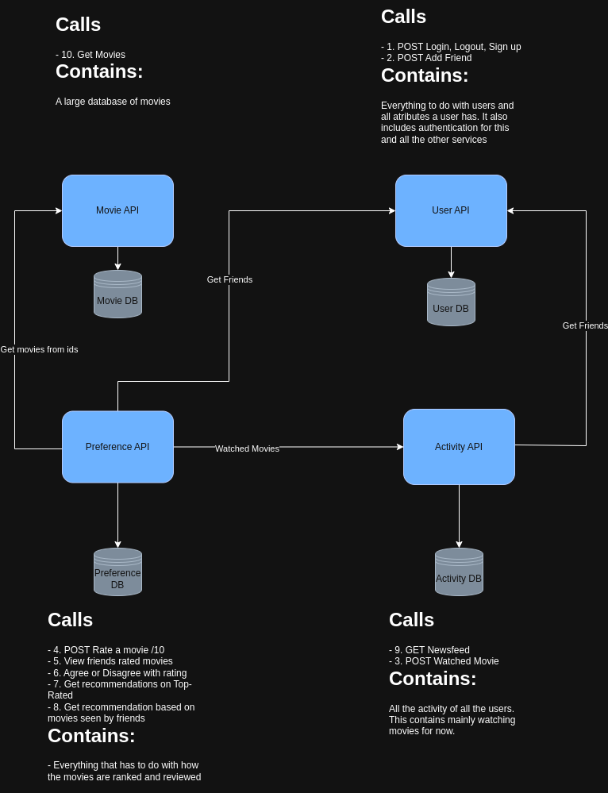

# Distributed Systems – Task 2

## Overview

This document outlines the architecture and design decisions behind my implementation for Task 2 of the Distributed Systems course.

---

## Core Services

### Movie Service & Activity Service

These two services are designed to be independent due to their scalability requirements:

- **Movie Service**: In a real-world scenario, the movie database could grow significantly. Keeping it as a separate service ensures it can be scaled independently and efficiently.
- **Activity Service**: Logs and user activity data can also become large in scale. By separating this into its own service, we ensure logging can scale without affecting other services.

> **Resilience**: If the Activity Service is unavailable, the Movie Service will still function. However, the newsfeed will be partially degraded as it depends on activity data.

#### Communication

- The **Movie Service** is self-sufficient.
- The **Activity Service** requires access to friend data from the User Service to generate personalized newsfeeds.

---

### User Service

This service handles **authentication**, **user management**, and **friend relationships**.

- **Authentication**: A dedicated auth service allows for secure, centralized login across services using shared public keys.
- **User Data**: User records naturally belong here, so the friend system is also integrated into this service.

> **Resilience**: This service is completely independent and can run without relying on other services.

---

### Preference Service

This is the primary user-facing service where all user interactions happen, including:

- Rating movies
- Viewing friend activities
- Receiving movie recommendations

Due to its central role in the user experience and heavy usage, it is implemented as a standalone service.

#### Communication

This service interacts with **all** other services:

- **Movie Service**: For retrieving and recommending movies.
- **User Service**: For accessing friend relationships.
- **Activity Service**: For retrieving friends’ activity logs.

> **Resilience**: If connections to other services fail, core functionality remains but is significantly reduced due to missing contextual data.

---

## System Design Rationale

While a more decoupled architecture was possible, I chose a design that reduces the complexity of the frontend. This means that two services (Preference and Activity) depend on others to offer full functionality, while the other two (User and Movie) are fully independent.

---

## Extensions

### Data Loading

- Movies are loaded into the database in a background thread from a `.csv` file during startup.
- This improves speed and safety, and benefits from ORM features rather than reading CSVs directly.

### Docker Compose

- Databases run in separate containers from services.
- Docker volumes persist data and cache dependencies.
- Health checks ensure services only start after their respective databases are ready.
- Restart policies automatically recover crashed services.
- Networks allow host access to database containers for inspection and debugging.

### Nginx

- An Nginx reverse proxy exposes all services via a single host.
  - `http://localhost/api/movies` → Movie Service
  - `http://localhost/api/users` → User Service
  - etc.

### Authentication

- **JWT Cookies**: Used for persistent authentication across services.
- **CSRF Protection**: Enabled across the application.
- **RSA Keys (RS256)**: JWTs are signed by the User Service and verified by other services, ensuring secure trust boundaries.

### Rate Limiting, Caching, and Error Handling

- **Rate Limiting**: Prevents API spamming.
- **Caching**: Reduces load on the Movie Service by caching frequent requests.
- **Error Handling**: All services provide consistent and user-friendly error responses.

### GitHub Actions

Automated CI/CD pipeline includes:

- Running all tests (API and database).
- Code linting and static type checks.
- Booting up the project and verifying functionality using `consume_api.py`.

### Database

- Managed via **Alembic** for migrations.
- Databases auto-rebuild from migrations when reset.
- New migrations apply automatically when available.

---

## Frontend

A custom frontend is available at `http://localhost`, interfacing with the backend APIs.

### Screenshots

  
  
  
  
  

